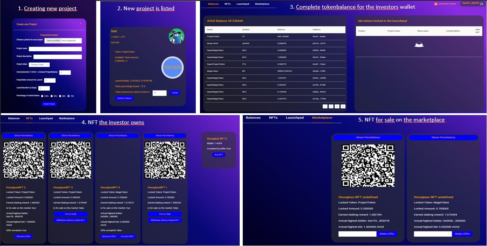

# Launchpad project for the Moralis Avalanche Hackathon 2022

This is a launchpad project devoloped during the Moralis Avalanche Hackathon. It uncludes onChain msart contracts (in the Truffle folder) and a React js frontend that is interacting wiht these contracts. User data as well as pricehistory for the nft marketplace are stored and loaded from a Moralis database. Also Moralis cloudfunctions are constantly monitoring the marketplace for new bids.

The worklfow for the launchpad can be devided into two parts.

# 1 A new project wants to distribute their tokens with this launchpad

The project can come to the launchpad and create an new token sale. They have to discribe their project and send all the tokens they want to distribute to the launchpad smart contract. Also they have to define the percentage of tokens that will be locked in the launchpad when an investory buys their tokens. After the launchperiod is finished the project can completely unlock the tokens. That will send all the locked tokens directly into the wallet of the investors unless they minted an nft for the locked tokens. That will be explained in part 2. Also if there are tokens that could not be distributed during the sale the project can withdraw them.

# 2 An investor wants to take part in a new token sale

The investor can come the launchpad, choose the project he/she wants to invest in and buy the desired amount of projecttokens. Only a certain percentage will go directly into the wallett of the investor. The rest will be locked in the launchpad until the project unlocks them. But the locked tokens are not useless for the investor. With these tokens he/she could mint an NFT (representing the locked token amount) and start earning interest on these tokens. Also the investor can sell the NFT on the marketplace or buy an NFT with tokens from another project. This will create a secondary market for the proejcttokens without affecting the actual tokenrpice and will give the investor a huge benefit of minting the NFT.

# 3 Using the code

After deploying the smart contracts with /migrations/4_deploy_marketplace, /migrations/5_deploy_nft and /migrations/6_deploy_magepad one have to add the contract addresses to the frontend in src\helpers\contractABI.js and in the cloud code src\cloud\cloudCode.js. Of course a running Moralis server is also needed. The Serverinformation must be written into the .env file with REACT_APP_MORALIS_APPLICATION_ID = .... and REACT_APP_MORALIS_SERVER_URL = ... After this the project is good to go.

